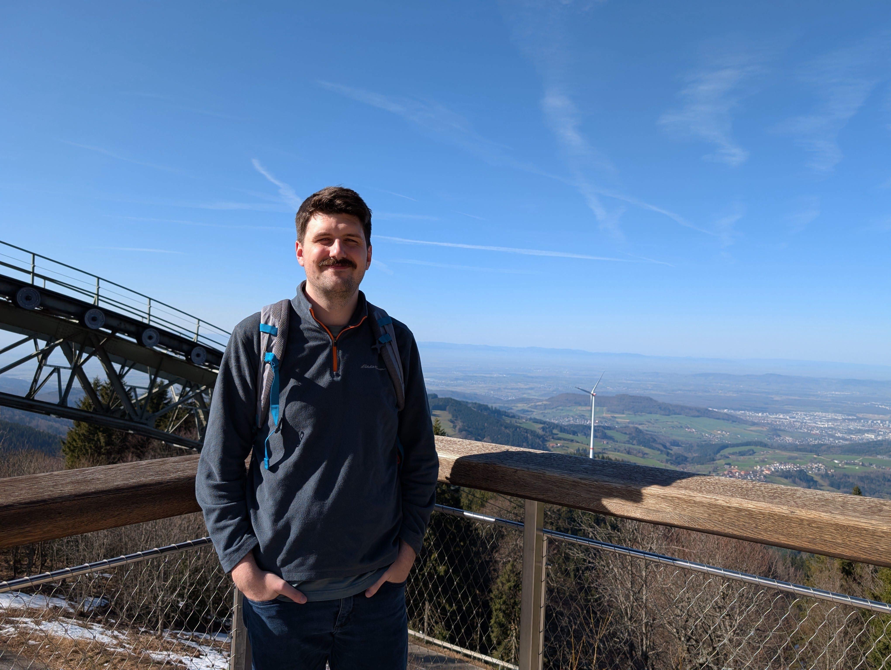

Today marks the end of the first week of my four week trip to Europe.

# The Journey

<figure class="center">
    
    <figcaption class="center">
        My backpack, fitting nicely into a duffel bag for the flight
    </figcaption>
</figure>

My trip began at a very lazy 8am last Saturday (exactly one week ago!).
Since my flight was out of Sea-Tac, I needed to first make the hour and a half drive down to Bellevue, to get a ride from my family.
While I had wanted to drive down the night before, but a combination of busy-ness at work and poor planning caused me to not be ready that night.

I arrived in Bellevue just before noon, and met my family there.
There, my father made an important adjustment to my trip planning: that I should travel with a large backpack rather than a suitcase.
He had stopped by REI that morning to pick up the backpack out of concern for my planning, and I cannot be grateful enough.
A suitcase, while in some ways easier to travel with, would have just been too inflexible for this kind of a trip.

A few hours later, I was happily on a thankfully uneventful flight across the Atlantic.

I think that this will be the last time that I schedule a seven hour layover.
What I thought would be a nice period of relaxation after a flight was actually seven hours of total exhaustion and boredom.
Heahthrow is a very busy airport, and the plethora of people coming and going meant it was almost impossible to find a good spot to rest.
I was very grateful when my flight to Basel finally was able to depart, albeit delayed by an hour.

# Basel

<figure class="center">
    
    <figcaption class="center">
        Basel, on the Rhine
    </figcaption>
</figure>

I arrived in Basel on Sunday evening totally exhaused, and that is how I spent most of my time there.
This wasn't the worst jetlag that I have ever experienced, but it unfortuantely took a few days for me to recover.
The morning after arriving, I willed myself out of bed and out to see the city.
I did not have anything planned for this day, so I just wandered about for a bit.
Basel is a very old city, with beautiful 19th century buildings, stone roads and bridges, and old churches.

However, as I approached the city center, I started hearing a Napoleonic tune, with the sound of drums and flutes echoing through the streets..
To my surprise, a group of ten or so people dressed in masks came out of an alley in front of me, playing and marching to this strange music.
Then, a minute later, another similar group approached from another street.
To my jetlagged brain, these almost felt like hallucinations.
Unknown to me, I had booked my brief stay in Basel to overlap with the festival of Fasnacht, a German Carnival celebration.
I did not take any photos of these marchers, as I did not see others doing so, and I felt that it may be considered rude.

I spent some time downtown, stopping for coffee and a book, before suddenly being overcome with exhaustion - I had only slept 7 hours the night before, and had been awake for 30 hours before that.
I returned to my hotel, and my quick afternoon nap turned into a full sleep.
When I awoke, it was three in the morning, and I needed to get ready to leave the city.
I enjoyed an early run along the Rhine, before packing my bags and heading back downtown to catch my train.

I am a bit sad that I did not spend more time in Basel, but my wallet might disagree - that coffee and book from earlier cost me nearly fifty dollars!
Switzerland is very expensive.

# Freiburg im Breisgau

<figure class="center">
    
    <figcaption class="center">
        Freiburg's Altstadt, or Old City
    </figcaption>
</figure>

I was very excited for the next stage of my trip.
Not only was I visiting Savannah, but I was also seeing Freiburg for the first time.
I have always wanted to visit Freiburg, as every description of it has been nothing but flattering.
Now that I have been there, I can confirm that everything said about the city is completely true.

The Altstadt (old city) is completely gorgeous.
While I understand that WW2 left a very destructive mark on the city, you cannot tell what is old and what is new in this district.
The old city gates and walls have been preserved, and the street layout (just for this district) is winding and sporadic in a way that makes each corner feel unique and interesting.
The [Bächle](https://en.wikipedia.org/wiki/Freiburg_B%C3%A4chle) make the roads feel alive, and add the sound of trickling water the the city.

Speaking of sounds - one sound typically present in cities was completely lacking, and that was the sound of cars.
The whole Altstadt district is pedestrianized, and the sight of cars and traffic is fairly rare.
What is common, though, are trams, bikes, and more than anything else, people walking places.
Of course, delivery vans are still allowed into the district to support the businesses there, but there are no cars circling waiting for parking, or horns of angry drivers.
It is a very serene place.

<figure class="center">
    
</figure>

Outside of the Altstadt, the city continued to impress me.
While Basel was very proud with its large stone architecture, Freiburg seemed to always prioritize green space.
Everywhere I went, you would see green, whether it was trees along the street, grass under the tram, or bushes separating the road from people walking.

Savannah met me at the train station, and together we took a tram to the Altstadt for lunch.
However, as may be expected, the sleep debt that I had encurred hit me all at once, and so we went back to her apartment so that I could finally catch up sleep.
After sleeping the full afternoon, and night, only waking for dinner in the evening, I finally was over my jetlag.

The next day, I awake early to a see that a cool mist had settled throughout the city.
Savannah showed me around the university where she was studying, and more of the city.
We walked from Mooswald, through Mitte, and again ate lunch in the Altstadt.
We then met with a few of her university friends to play board games until it was dark.

One thing that surprised me was just how *warm* it was during the day.
The city was quite cold at night, but the sun had me so warm that I did not need, or even want my jacket.
There had to have been a 30-40 degree fluctuation in temperature, every day!
Freiburg has a reputation as the warmest city in Germany, but to me that sounded like someone talking about the sunniest neighborhood in Seattle.
I didn't quite understand just how hot it could get, even in the middle of winter.

<figure class="center">
    
    <figcaption class="center">
        Stauinsland
    </figcaption>
</figure>

On Thursday, we left the city to venture towards Stauinsland, one of the large hills near the city, marking the beginning of the Alps.
Getting there was quite easy, just a tram, a quick transfer to a bus, and finally a gondola up the hill.
Apparently, this is the longest gondola in Germany!
After letting the gondola do all of the hard work getting up the hill, we "hiked" around for a while.
It was around this time that I remember that I, in fact, *should* be taking photos during my trip, and so most of the photos are from this day.

<figure class="center">
    
    
    <figcaption class="center">
        Stauinsland
    </figcaption>
</figure>

We returned back to town where I had one of the richest hot chocolates of my life.
After that, we ran a few errands, and before we knew it, the day was over!

My final full day in Freiburg was a mostly battery-recharging day, and preparation for the next phase of the trip.
I did not go far out of Mooswald, just walking around the trails in the immediate area.

# Onwards

Today, Savannah and I left Freiburg for Copenhagen.
I am writing this from the Deutsche Bahn as we approach Hamburg for a transfer.
I am looking forward to whatever awaits me next!

