Ok, I have just finished my second week in Europe, and what a week this has been!
This past week took me across Scandinavia.
I visited the cities of Copenhagen, Oslo, and Bergen, and have done so much that I cannot even remember all of it.

# Train to Copenhagen - Day 6 (end)

<figure class="center">
    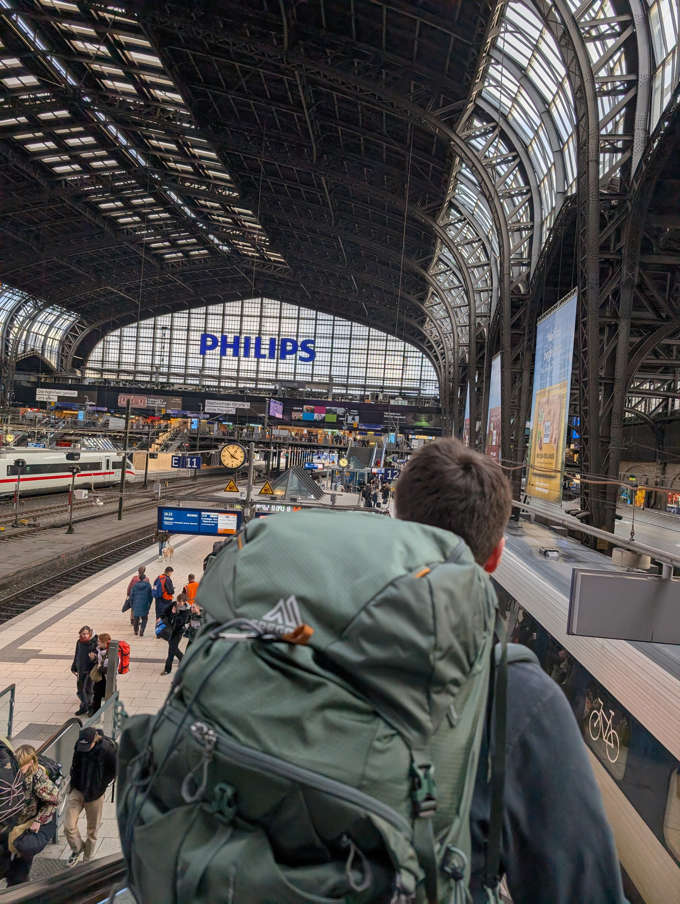
    <figcaption class="center">
        Hamburg Hauptbahnhof, a.k.a. the palace of pidgeons
    </figcaption>
</figure>

My last post was written on the way to Copenhagen, just before a change of trains in Hamburg.
The rest of that journey was pleasant - Savannah and I chatted with a professor from Kiel and a very outdoorsy woman from Copenhagen.
The trip was long, and it was pleasant to talk to some fellow travellers to pass the time.

I did make a startling discovery on this train - there was no cafe car!
Apparently, cafe cars are *not* a universal concept, as I had previously thought.
I am too used to Amtrak Cascades and Deutsche Bahn trains, where cafe cars are the norm.
My plans for dinner on the train were completely thrown into disarray, and I had to settle for some chips and an energy bar to satiate me.

I arrived in Copenhagen after 9 PM, and was totally exhaused.
Fortunately, Savannah had found us a nice hotel just a block from the the train station, the Axel Guldsmeden.
We checked in and quietly settled in for the night.

# Copenhagen - Day 7

The next day would be our only full day in Copenhagen, so we left the hotel early and headed straight for the city center.
When I have limited time to explore a city, I don't like to spend it visiting indoor tourist attractions, like museums or art galleries.
To be honest, while each city does have its own unique collections and presentations for these kinds of exhibits, they never really feel distinct to me.
I prefer to walk around the city, take the transit, visit the parks, and find local places to eat and shop.
This kind of travel is much more relaxing for me, and I feel like it gives me a better guage on what a city is like to live in (which, is kind of the point of cities).

<figure class="center">
    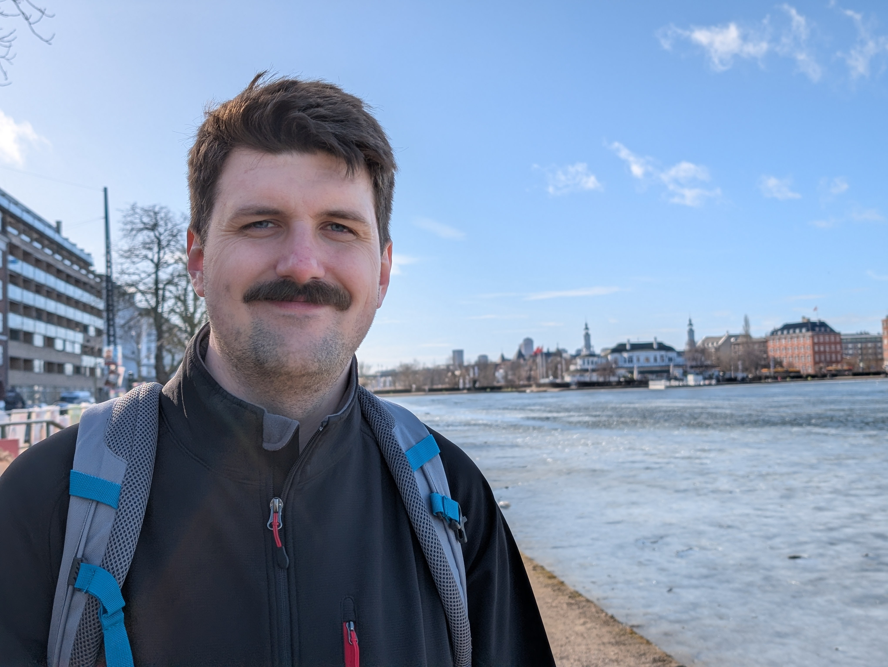
    <figcaption class="center">
        Near one of the frozen canals (?) in Copenhagen
    </figcaption>
</figure>

To that point, I spent much of the morning meandering around Copenhagen's central district, before eventually walking over to a gluten free bakery.
I was like a kid in a candy shop there; everything looked so good to eat.
I bought three pasteries, and am ashamed to admit that I had finished all of them by the end of the day.
It is hard to come by good baked goods with Celiac disease, so I binge a little when I do find them.

<figure class="center">
    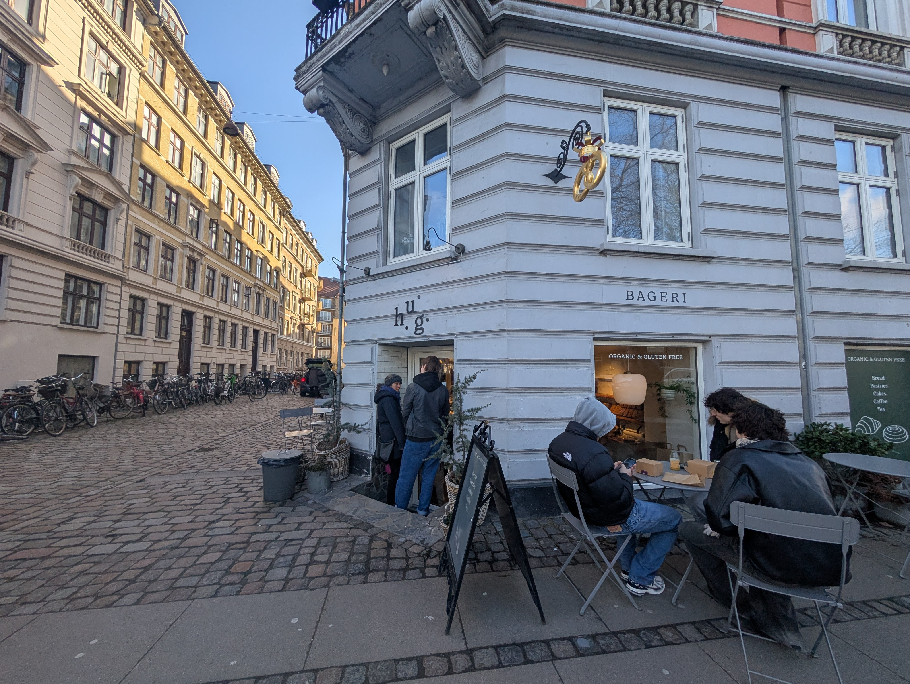
    <figcaption class="center">
        H.U.G. Bakery
    </figcaption>
</figure>

For lunch, we ate at some keto-inspired place (possibly a chain?).
It was at least located in a pretty cool building, where many shops and stands were set up underneat a large glass structure, like a greenhouse.
It looked to me a bit like something that you might find in Vancouver.

The rest of the day was spent meandering more through the city, before we made a fateful decision: pizza for dinner.
The pizza was delicious, but it (and possible the aforementioned pasteries) had the side effect of putting me completely out of commission for the rest of the night.
Seriously, I barely made it back to the hotel room before I collapsed into a two hour nap.
I only woke back up to make use of the hotel gym and pack my bags before retiring again to sleep.
So much for exploring Copenhagen at night.

# Train to Oslo - Day 8

The next morning started early: I had a 7:30 train to catch, and needed to eat breakfast and checkout first.
Our train to Oslo was a bit faster than the train to Copenhagen (8 hours vs 12 hours), and included a full hour switching trains in Gothenburg.
I watched out the window as the flat landscape outside was slowly covered in a cool mist.
After a few hours, a few hills poked out from that mist, marking that I definitely had left Denmark (if the big bridge and tunnel outside of Copenhagen had not already done that).
After changing trains, I began to see snow and ice on the ground.
I was definitely in Scandinavia now.

<figure class="center">
    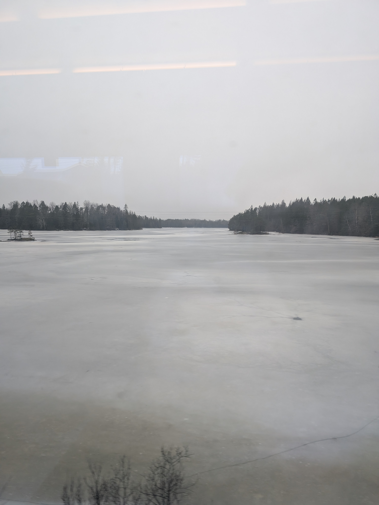
    <figcaption class="center">
        Sweden, for the brief moment that we were there
    </figcaption>
</figure>

It was firmly in the afternoon when we arrived in Oslo.

<figure class="center">
    
    <figcaption class="center">
        Oslo, just outside the central station
    </figcaption>
</figure>

I had booked an Airbnb for the stay, but in retrospec it was a terrible idea.
I had previously had decent experiences with Airbnb in a previous trip to the Netherlands and Germany, and I guess I expected the same.
Instead, the experience was... just weird?
The apartment that I had booked did not have enough bedding for two of us, even though that had explicitly been guaranteed, there was wet laundry in the washer, there was no soap, dish, body, or otherwise, and, to top it all off, there was aonly a half a roll of toilet paper provided.
Another Guldsmeden, as I have really grown to like that chain.

After checking in and settling into the hotel room, I only had one thought on my mind: FOOD.
This is where I took the first steps in what was to be a shocking discovery: Norway is HEAVEN for celiac sufferers.
I think that I will write a blog post fully dedicated to comparing the celiac experience in different countries (or, even different cities), but I will just summarize Norway quickly here:

In Norway, it seems that there is some law regulating allergens, not just at the grocery level, but also at the restaurant level.
Every menu comtains *complete* allergen information for some very reliable categories.
This is not just the (V) (GF) markers that you may be used to in American, Canadian, or German restaurants.
Every single menu item has little indicators showing a plethora of allergen categories that they contain, and these categories show up in the same order, no matter the restaurant.
I have never felt so safe eating at any restaurant.
Sure, some of the casual cross-contamination still existed (reused cutlery, etc), but if I said "celiac", every waiter always responded something along the lines of "okay, we will use a separate cook surface for you".
*Fantastic.*
*Incredible.*
It almost made the $30 average meal cost feel good.

Dinner that night was Sushi, and it was very good.

<figure class="center">
    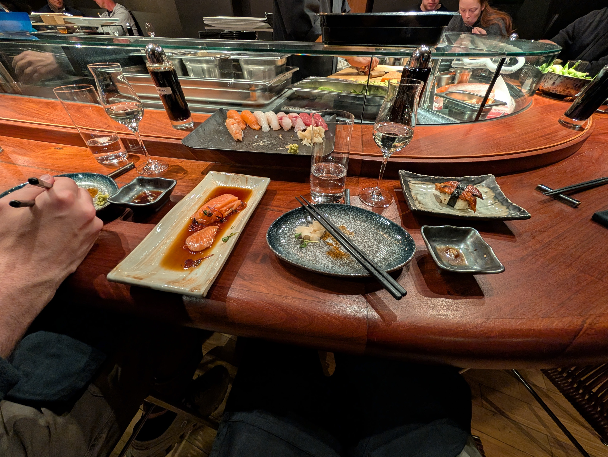
    <figcaption class="center">
        Sushi in Oslo
    </figcaption>
</figure>

# Oslo - Day 9

The next day was all meandering, except this time we managed to clock nearly 20km of it.
We walked *all over* the city, seriously.
I am just going to photo dump and mark captions of what we did, because it was very ad-hoc and doesn't appear well in prose.

<figure class="center">
    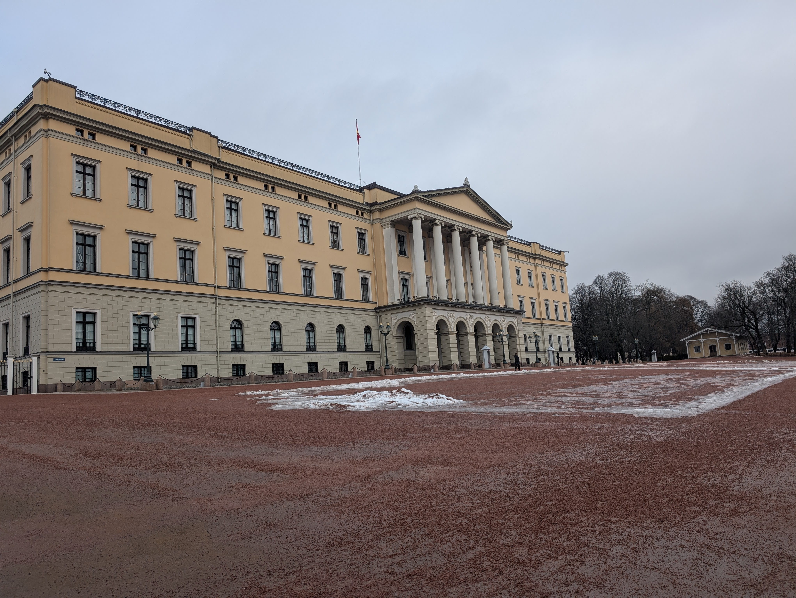
    <figcaption class="center">
        "The Royal Palace", not sure if people actually live here, as it is in a large park
    </figcaption>
</figure>

<figure class="center">
    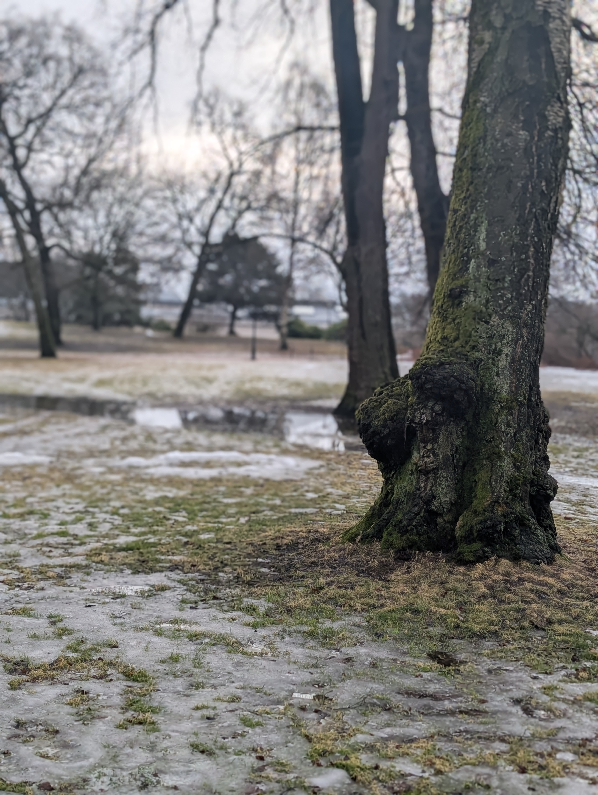
    <figcaption class="center">
        The park surrounding the palace
    </figcaption>
</figure>

<figure class="center">
    
    <figcaption class="center">
        A weird fake tree by the waterfront
    </figcaption>
</figure>

<figure class="center">
    
    <figcaption class="center">
        Savannah and me by the waterfront
    </figcaption>
</figure>

<figure class="center">
    
    <figcaption class="center">
        Another gluten free bakery
    </figcaption>
</figure>

<figure class="center">
    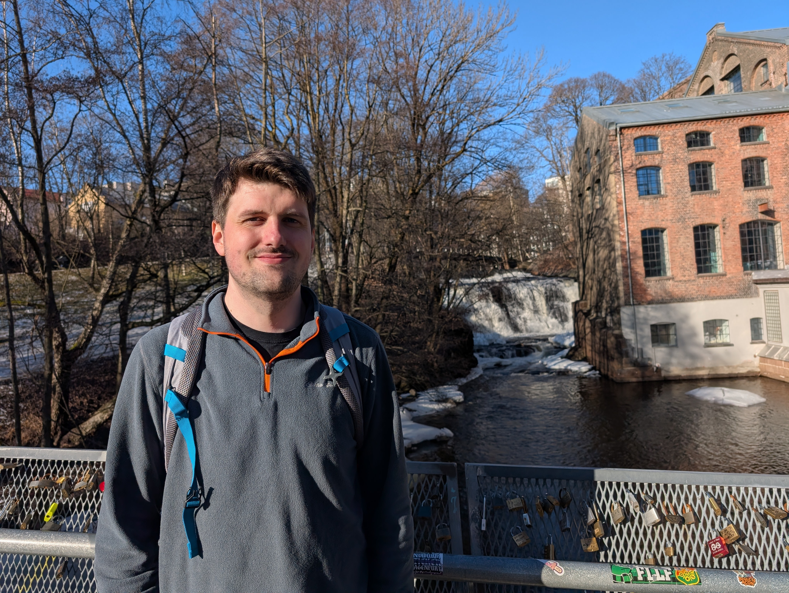
    <figcaption class="center">
        Akerselva is a small creek that runs through Oslo.
        A nearby path runes along it for a few kilometers.
    </figcaption>
</figure>

<figure class="center">
    
    <figcaption class="center">
        I guess American cities aren't the only ones that paved over tram lines at some point
    </figcaption>
</figure>

We grabbed a drink that night at a local pub.
Again, every pub/bar/restaurant in Scandinavia seems to have at least one gluten free beer selection.
I seriously feel like I have gone to heaven here.

# Train to Bergen - Day 10

A later train the next day meant that we could sleep in a bit.
We left the hotel room at 8 am,
shocking!
After a pleasant breakfast, we checked out and made our way back to the train station.

I did not do much on the seven hour train ride to Bergen, but I will let my photos of the track speak for themselves.
This train ride is truly spectacular, and it is something that I would recommend for anyone travelling to Norway.

<figure class="center">
    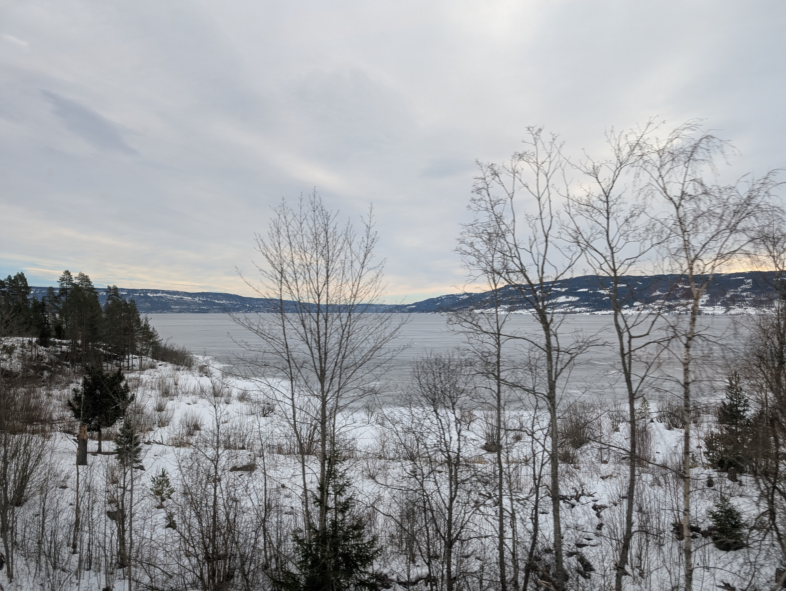
    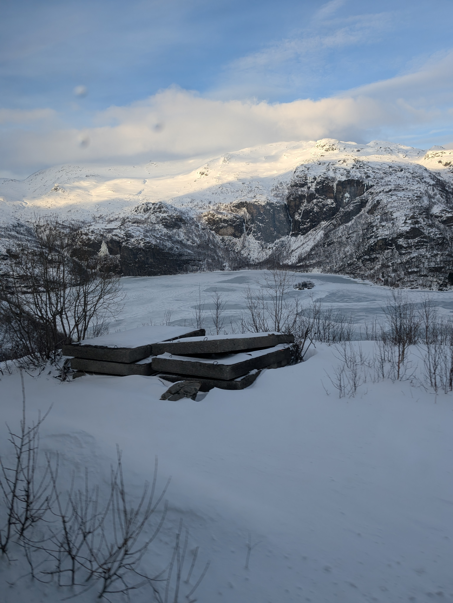
    
    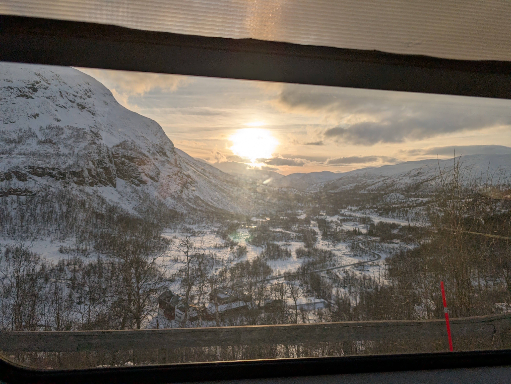
</figure>

Fortunately, our Airbnb in Bergen was much nicer than Oslo.
It was right in the city center, just outside of an old church building.

<figure class="center">
    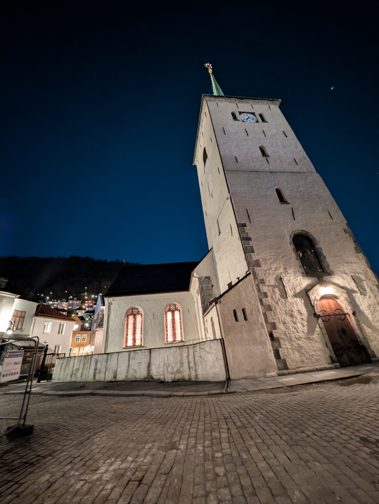
</figure>

<figure class="center">
    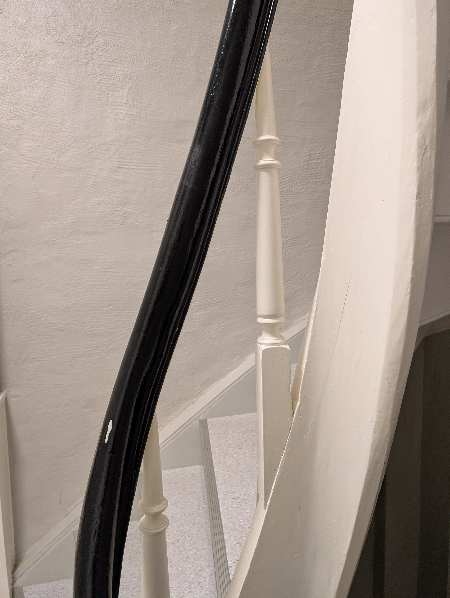
    <figcaption class="center">
        The stairs to the Airbnb were a bit steep
    </figcaption>
</figure>

We had beer at another local pub, and called it a night.

<figure class="center">
    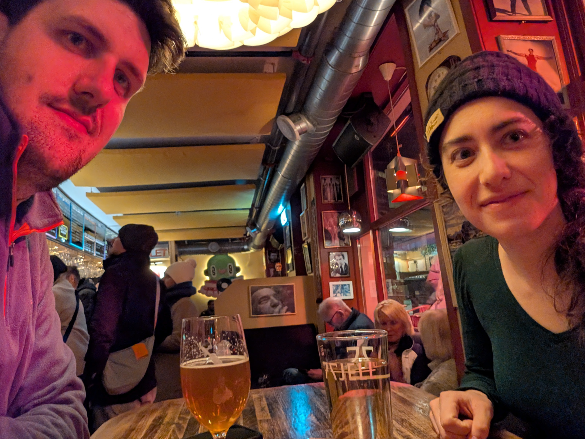
    <figcaption class="center">
        Notice anything in the background? Just when I thought I could skip my German practice...
    </figcaption>
</figure>

# Bergen - Day 11

Whew, this day was *exhausting*, and it was mostly my fault.
Our mission, from the moment that we woke up, was that we were going to visit a fjord.
There are many fjords near Bergen, but the closest and easiest to visit was [Veafjorden](https://en.wikipedia.org/wiki/Veafjorden), as it was just a train ride away.
First, though we needed to eat and wake up.

<figure class="center">
    
    <figcaption class="center">
        Bergen in the day
    </figcaption>
</figure>

Unfortunately, it seems like breakfast is a bit of a late activity in Bergen.
We could not find a place that opened before 10, so we walked around the town a bit to pass the time.
Since it was so late when we ate, I decided to declare it "brunch", and ordered a pretty big bowl of chicken, veggies, and rice for myself.
Poor savannah got a (very delicious looking) egg croissant, and did not fill up on carbs and protein in quite the same way.
This would come back to bite us, later.
After eating, it was time for a quick half hour trip to the fjord.

<figure class="center">
    
    <figcaption class="center">
        Veafjorden
    </figcaption>
</figure>

The visit to the fjord was quick, and pleasant.
We got off at Stanghelle and walked around for about half an hour before the return train came to take us back to Bergen.
All in all, it was neat, we saw a fjord.
There are also fjords in Washington, but I would say that this one is a bit more dramatic than those.

After returning, I had only one thought on my mind: the [Bergen bike tunnel](https://en.visitbergen.com/things-to-do/cycling-through-the-worlds-longest-bike-tunnel-p7102493).

Since I am a bit of a nerd for transit-related projects, and I a am a casual cyclist, I was very excited to see this.
I had heard about the tunnel when it first opened, and visiting it has been a bit of a bucket-list item for me.
A brief summary of the tunnel is:
Bergen wanted to open a tram line between the eastern and western sides of a large hill in the city.
This would require digging a 3 km tunnel for the tram, as well as a service tunnel.
At some point in the planning, someone absolute *genius* spoke up with the idea that maybe the service tunnel should instead just be expanded to a pedestrian and bike tunnel, since 3 km is not a large enough distance to make cyclists want to take a tram.
So, the city did exactly that, and now the world's longest bike tunnel exists.

Anyways, we walked down to see that right off of the train.
Originally, we were going to rent bikes, but I was in the mood for walking, and I have had issues renting bikes abroad in the past.
It was a bit of an ugly urban walk to get there, but the tunnel itself was very nice.
I even had cell signal in it!

<figure class="center">
    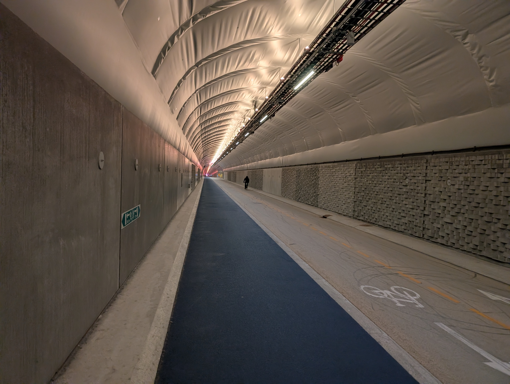
    
    <figcaption class="center">
        The Bergen bike tunnel
    </figcaption>
</figure>

On the other side of the tunnel, there didn't seem like much to see.
There was a mall, and a few roads, and what looked like a fairly suburban area of the city.
When I looked at a map, though, I had a *great* idea: why not walk back to the Airbnb?
It looked pretty simple - we had gone out of the way to get to the entrace to the bike tunnel, and then tunnel itself had not moved us that much further than the city center.
All that we would need to do was get over a small hill, and we would be home free!

This turned out to be a very difficult walk.
The ground was cement and hard, not like the dirt that you would find on a hike, and it had been a pretty long time since we had eaten.
Poor Savannah, who hadn't even really had a lunch, was fading before we had even finished the first kilometer.
We pushed on, though, and were rewarded with some nice views of the city from its southern hill.

We were completely exhausted, but still hungry for a good dinner.
Fortunately, that is exactly what we found at [Escalón Mundo](https://escalonmundo.no/), a Latin American, but also "world" themed restaurant with good chorizo.

# Bergen - Day 12

Since we knew that eating out was not an option for an early breakfast, we had thought ahead and bought crackers, cheese, and smoked salmon the night before for some delicious lox in the morning.
We needed the fuel, as our task for the day was to climb the big hill, Mount Fløyen, which was right next to the Bergen city center.
It had been taunting us ever since we arrived from the train, and we knew that we absolutely *had* to hike it.
Online maps indicated that there was a good trail network around the hill, but it really understated just now *nice* these trails were.
They started fully paved concrete near the base, where I assume that locals go on daily walks, and smoothly transitioned to very well maintained and compacted gravel near the top.

<figure class="center">
    
    <figcaption class="center">
        A tram to get to the top, if you do not want to brave the rain
    </figcaption>
</figure>

<figure class="center">
    
    <figcaption class="center">
        Bergen through the trees of the hike
    </figcaption>
</figure>

It was a very light drizzle when we set out, and that kept up nicely throughout the hike to keep us cool.
We did get a few funny looks from locals, since we were both overheating in our rain gear, and were just wearing fleeces for the hike.
However, as true Cascadians, we actually enjoyed the wet walk through the rain.
As much as I like exploring urban centers, spending some time in nature, even if it is just on the outskirts of the city, was extremely pleasant.

<figure class="center">
    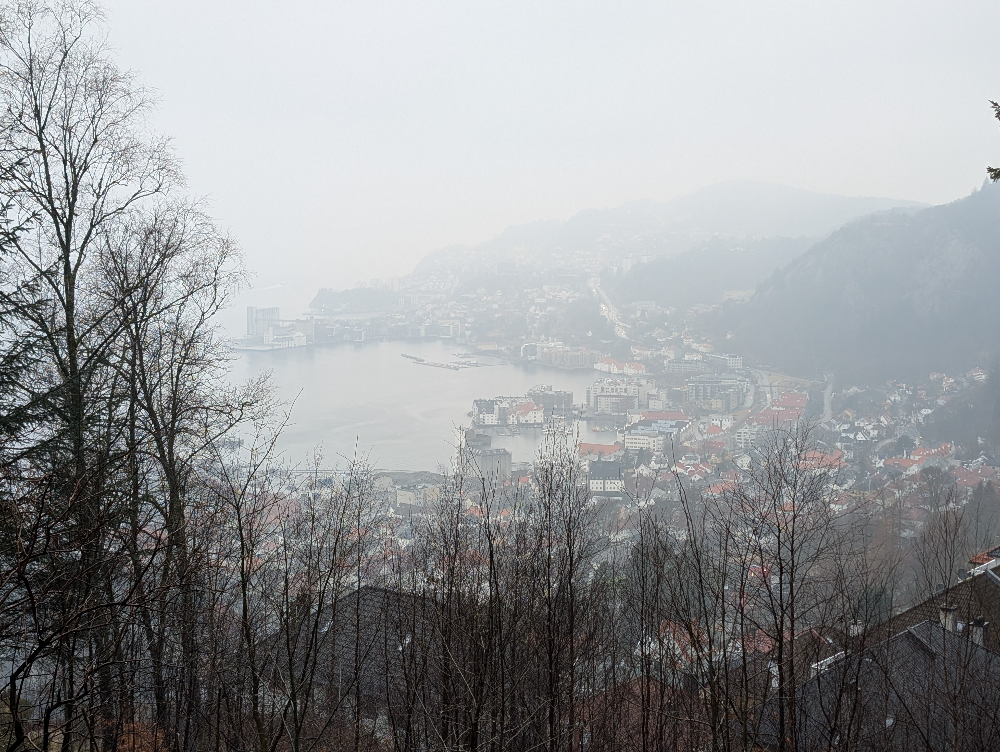
    <figcaption class="center">
        Many nice city views along the hike
    </figcaption>
</figure>

<figure class="center">
    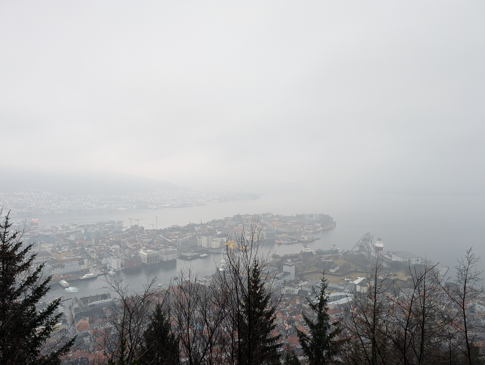
    <figcaption class="center">
        View from near the top of the hike
    </figcaption>
</figure>

The full hike was around 400 meters vertical (1300 feet), and around 6 km distance.
Very short, and definitely not the most exerting hike that I have ever been on, but it was a welcome change of pace.
The photos that I took from that day were absolutely *gorgeous*, though, in a very PNW kind of way.
Between the light drizzle, the sound of the ocean, the dense undergrowth beneath the evergreen forest, and the steep, dramatic landscape, I was very much reminded of home on that trail.

<figure class="center">
    
    <figcaption class="center">
        I could be fooled into thinking that this was Washington
    </figcaption>
</figure>

Our hike ended around noon, and we spent the rest of the day being a bit lazy.
We had been on the move so much between Copenhagen, Oslo, and Bergen, that it was nice to take a day to relax in cafes, check up on work, etc.
We ordered dinner in to our Airbnb and spent our last night in Bergen watching Star Trek.

It was very nice.

# Train to Oslo - Day 13 (start)

That brings me to today!

After waking up and checking out of the Airbnb, we spent our last morning in Bergen hanging out at a local cafe.
Savannah is flying home today, which meant that when I caught a noon train back to Oslo, we had to say our goodbyes.
As I have been writing this, I have been enjoying the same beautiful Bergen-Oslo train that I got to enjoy on the way in.
The scenery is still as absolutely stunning as it was when I had first seen it, and I am glad to see it again.

I will now be beginning the solo part of my trip, which I am both nervous and excited for.
I cannot wait to see what awaits me next.
I will be spending tonight in Oslo again, before heading out to Sweden tomorrow.
